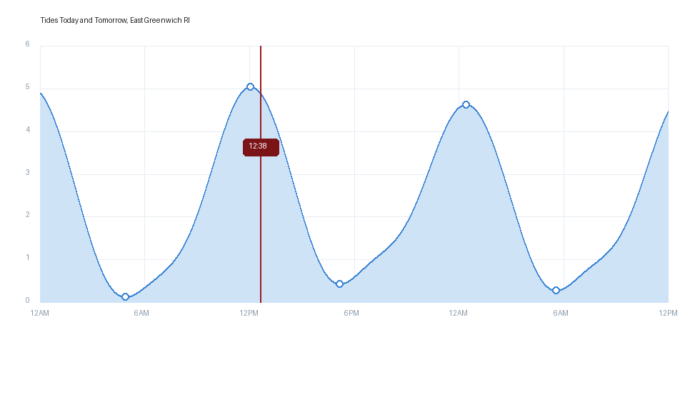

# esphome-tide — offline harmonic tide prediction for ESPHome

A custom ESPHome component that predicts tides **fully offline, from the current
time alone** — no internet, no API. It runs the classic harmonic method
(`h(t) = Z0 + Σ fᵢ·Hᵢ·cos((V0+u)ᵢ − κᵢ)`) on-device and exposes the same
outputs as an online NOAA tide module, so it drops straight into an existing
tide-clock UI.

The harmonic constants for **one** station are passed in as a compact string.
A Python generator builds that string from the worldwide
[openwatersio/tide-database](https://github.com/openwatersio/tide-database)
(~7,600 stations).

## Why on-device astronomy

The node factor `f` and equilibrium argument `V0+u` change over the 18.6-year
lunar nodal cycle. This component computes them on-device from the current UTC
time (a port of [pytides](https://github.com/sam-cox/pytides)'s Meeus/Schureman
astronomy), so a station string never needs regenerating — it stays accurate for
decades. Only the current time is required.

### What this is modeled on
| Layer | Basis |
|---|---|
| On-device C++ prediction loop | [millerlp/Tide_calculator](https://github.com/millerlp/Tide_calculator) |
| Nodal-correction astronomy (f, V0+u) | [pytides](https://github.com/sam-cox/pytides) / [openwatersio/neaps](https://github.com/openwatersio/neaps) |
| Component structure (hub + sub-platforms) | ESPHome's built-in `sun` component |
| Station data | [openwatersio/tide-database](https://github.com/openwatersio/tide-database) (public-domain NOAA constants) |

## Layout

```
components/tide/            # the ESPHome component (external_components)
  __init__.py              # hub schema/codegen
  tide.{h,cpp}             # engine, extrema finder, sensor getters
  tide_astronomy.{h,cpp}   # mean longitudes + Schureman node factors (double)
  tide_constituents.{h,cpp}# 37 NOAA constituents (Doodson coeffs + node type)
  tide_station.{h,cpp}     # parses the "TIDE1|..." station string
  sensor/                  # numeric outputs (height, %, levels, MHW/MLW)
  text_sensor/             # formatted high/low tide times
generator/                 # Python: build & validate station strings
  generate_station.py      # openwatersio JSON -> "TIDE1|..." string
  constituent_index.py     # canonical name table (mirrors the C++)
  tide_reference.py        # pure-Python port of the engine (for validation)
  validate.py              # diff vs NOAA CO-OPS published predictions
  check_tables.py          # assert Python/C++ constituent tables agree
test/                      # host-platform build + C++/reference diff
```

## Try the SDL demos

Two self-contained desktop demos (station 8452944, East Greenwich / Conimicut
Light) run in an SDL window — no internet, no hardware:

```bash
cd example
esphome run sdl_demo.yaml      # tide gauge: arc %, current height, next high/low
esphome run sdl_graph.yaml     # filled tide-curve graph (see below)
```

(needs `libsdl2-dev`, like any ESPHome `host` + `sdl` build.)

### Tide-curve graph

`sdl_graph.yaml` draws a filled tide curve with high/low markers, gridlines and a
live "now" line, painted onto an LVGL **canvas** via the LVGL C API from a lambda
(ESPHome 2026.7 has no `chart` widget). The curve comes from the component's
`predict_series()`.



*(Preview rendered from the same curve math the firmware uses.)*

Graphing API on the component:

```cpp
float predict(time_t utc);                                     // height (display units) at any time
void  predict_series(time_t start, int step_s, int n, float*); // fill n heights for a curve
```

## 1. Generate a station string

Find your NOAA station id at <https://tidesandcurrents.noaa.gov/map/> (any id
present in the tide-database `data/noaa/` folder works), then:

```bash
cd generator
python generate_station.py --id 8452944            # prints the TIDE1|... string
python generate_station.py --id 8452944 --sample 24 # eyeball 24 h of predictions
```

The string embeds the datum offset `Z0`, MHW/MLW, and each constituent's
amplitude + Greenwich phase — a few hundred bytes, human-inspectable.

## 2. Use it in ESPHome

```yaml
external_components:
  - source: { type: local, path: components }   # or git

time:
  - platform: sntp        # or homeassistant — only used to get the current time
    id: system_time

tide:
  id: my_tide
  time_id: system_time
  units: ft               # or "m"
  station_data: "TIDE1|U=m|Z0=0.6420|...|M2:0.576:7.6|..."   # from step 1

sensor:
  - platform: tide
    tide_id: my_tide
    type: tide_percentage      # 0=just past high, 50=low, 100=high
    id: tide_percentage
  - platform: tide
    tide_id: my_tide
    type: high_level           # bounding high tide level
    id: high_tide_level
  - platform: tide
    tide_id: my_tide
    type: low_level
    id: low_tide_level
  - platform: tide
    tide_id: my_tide
    type: current_height       # instantaneous height (new vs the NOAA module)
  - platform: tide
    tide_id: my_tide
    type: mean_high_water
    id: mean_high_water
  - platform: tide
    tide_id: my_tide
    type: mean_low_water
    id: mean_low_water

text_sensor:
  - platform: tide
    tide_id: my_tide
    type: high_time            # "10:58 AM" (local time)
    id: high_tide_time_sensor
  - platform: tide
    tide_id: my_tide
    type: low_time
    id: low_tide_time_sensor
```

These sensor IDs mirror the online NOAA module
(`esphome-modular-lvgl-buttons/ui/tides/NOAA_tide_update.yaml`): `tide_percentage`,
`high_tide_level`/`low_tide_level`, `mean_high_water`/`mean_low_water`,
`high_tide_time_sensor`/`low_tide_time_sensor` — so an existing LVGL tide UI binds
to it unchanged. Swap the `!include` of the NOAA package for this `tide:` block.

Available `sensor` types: `current_height`, `tide_percentage`, `high_level`,
`low_level`, `next_high_level`, `next_low_level`, `mean_high_water`,
`mean_low_water`, `high_epoch`, `low_epoch`, `next_high_epoch`, `next_low_epoch`.
Available `text_sensor` types: `high_time`, `low_time`, `next_high_time`,
`next_low_time` (each with an optional `format:` strftime string, default
`%I:%M %p`).

`high_*`/`low_*` are the tides **bracketing now** (one may be in the past — this
mirrors the NOAA module, e.g. for a "since last low / until next high" clock).
`next_*` are the **strictly upcoming** high and low (both in the future) — use
these for "next high/next low" readouts.

## Verification

The engine is validated as a chain, each step diffed against the previous:

```bash
# 1) C++ engine vs the Python reference (compile + diff)
cd test
g++ -std=c++17 -O2 engine_test.cpp \
    ../components/tide/tide_astronomy.cpp ../components/tide/tide_constituents.cpp -o engine_test
python compare_cpp.py fixtures/8452944.string      # -> max |diff| 0.000000 mm

# 2) Python reference vs the ORIGINAL pytides source, incl. 2025–2040 nodal cycle
#    (see the pytides_oracle harness) -> max |diff| ~2.6e-5 mm

# 3) Full component compile + live run on the host platform
esphome compile host_test.yaml
esphome run host_test.yaml                         # logs live high/low/%, matches ref

# 4) (when NOAA API is reachable) vs NOAA CO-OPS published predictions
cd ../generator && python validate.py --id 8452944 --days 3

# table drift guard
python check_tables.py
```

## Notes / accuracy

- All astronomy is `double` — single precision loses minutes of tide timing.
- Predictions are on the station **chart datum** (MLLW by default), matching NOAA.
- Times are computed in UTC; local time is applied only for display, so DST is
  handled automatically.
- Accuracy is bounded by the published harmonic constants (openwatersio /
  NOAA), not the engine — the engine reproduces pytides to nanometres.

## Data / license

Harmonic constants: openwatersio/tide-database (NOAA data — public domain).
Astronomy ported from pytides. Always confirm predictions against an official
source before relying on them for navigation.
